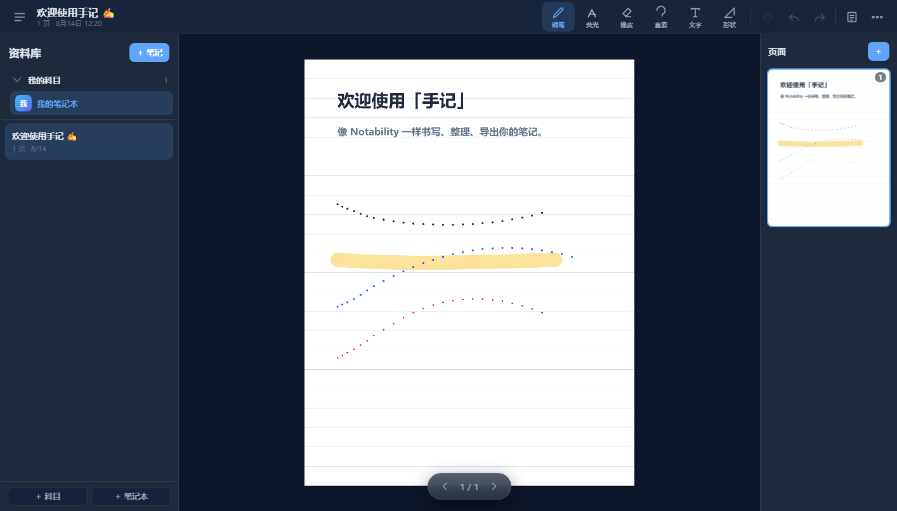
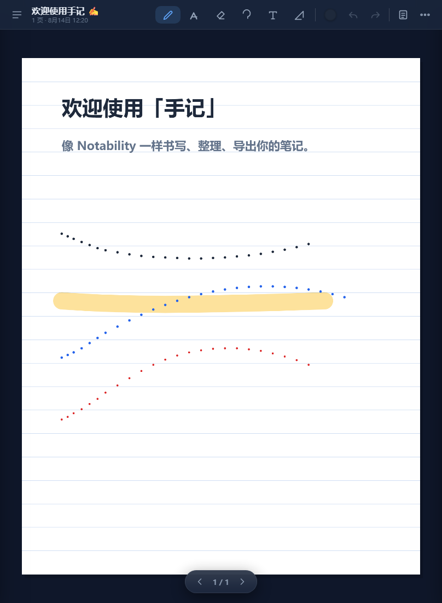
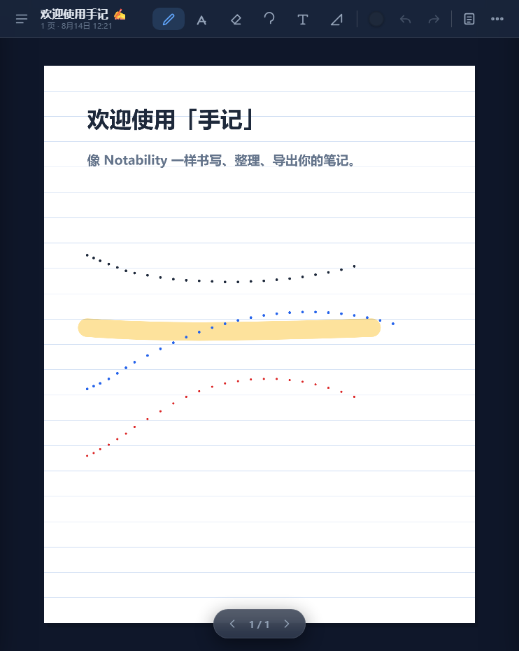

# 笔记 Note 2 —— 精美手写笔记（iPad 优先）





一款 Notability 风格的手写笔记 Web 应用，专为 iPad + Apple Pencil 优化，
**零依赖、纯静态、离线可用**，支持完整的数据持久化与文件转移。

## ✨ 功能

| 类别 | 功能 |
| --- | --- |
| 书写 | Apple Pencil 压力感应钢笔、荧光笔（乘色混合）、橡皮擦（整笔擦除，双击橡皮快速清空）、套索选择（移动/删除/复制/拖拉角点缩放，选中后有操作条）；手绘形状按住或松手自动识别并磁吸到网格；笔型可切换，常用工具可收藏 |
| 工具 | 扫描文档（拍照/相册多张连拍，生成多页笔记），文字输入（样式条：字号/加粗/斜体/下划线/对齐/颜色/高亮/预设，字体可换）、形状、12+ 颜色、粗细可调、插入图片/拍照（可旋转、可裁剪）、PDF 导入标注（可选页范围）、笔记附件（任意文件）、拖放文件到画布直接插入 |
| 手势 | 双指上下滑连续滚动、双指左右滑翻页、双指缩放（所有页一起）、双指轻点撤销、三指轻点重做、写至页尾自动翻页 |
| 界面 | 多笔记标签页（Notability 风格顶部标签栏，快速切换/关闭已打开的笔记），批注模式（专注单页），工具条三布局（顶部/左侧/底部）自由切换，设置中心分栏分类，6 套主题强调色（蓝/紫/粉/绿/橙/石墨），渐变玻璃质感 |
| 录音 | 每篇笔记录音/回放/删除（需 https 环境），录音按钮脉冲提示，面板显示录音数与总时长，波形预览、点击波形定位，回放调速 0.5x–2x、跨页自动翻页跟随，录音时自动记录翻页事件（回放时按时间线自动切页），每段录音可单独导出为音频文件；支持朗读当前页文字（中文 TTS，逐句朗读并高亮当前句的文字框，速度可调、可暂停/继续） |
| 纸张 | 纸张大小（标准/宽版，切换时自动缩放过程内容），空白 / 横线 / 方格 / 点阵 / 康奈尔 / 清单 / 计划表 / 故事板 / 乐谱 / 法律纸 × 6 色（细腻纸纹），行距可调；模板中心同时展示内置模板与自定义模板，内置 7 个常用模板 + 自定义模板，新建可选模板、可插入/应用、一键存为模板；PDF/图片背景透明度可调 |
| 组织 | 新建菜单内置模板（课程笔记/会议纪要/读书笔记/周计划/待办清单，含标题文字），科目 → 笔记本 → 笔记（笔记本可自定义封面颜色/符号，笔记可加颜色标签并筛选），「最近」快捷视图汇总跨笔记本最近编辑；笔记列表带首页缩略图；全局搜索（ESC 快速清除）+ 笔记内查找 + 大纲（分级）+ 统计 + 页面拖拽排序 |
| 撤销 | 完整撤销 / 重做（书写、擦除、移动、文字、纸张、页面） |
| 持久化 | IndexedDB 自动保存 + localStorage 备份 + 自动快照（最近 10 份可恢复），关闭后数据不丢失；设置中显示本地存储占用（可了解浏览器分配空间） |
| 转移 | 导出 `.note` / PDF（带页眉页码）/ 资料库 `.notebook` / 笔记文字 `.txt` / 富文本 `.rtf`，导入笔记文件；支持 iPadOS「分享」发送到「文件」/隔空投送；快捷键 Ctrl+N 新建 / Ctrl+D 复制页 / Ctrl+F 查找 / Ctrl+G 大纲 |
| AI | 内置 AI 助手（DeepSeek 模型，经电脑端服务器代理，密钥不进入前端）；可结合当前笔记提问、一键总结当前笔记，流式回答，回答可一键插入当前页或朗读 |
| 演示 | 演示模式：全屏展示当前笔记，批注可选 5 色、支持自动播放、进度条与计时器，左右翻页（触屏/键盘方向键），内置激光笔 + 临时荧光笔批注（退出自动清除） |
| 账号 | 注册 / 密码登录，笔记按账号隔离存到服务器，多设备同步（局域网版） |

## 🚀 在 iPad 上使用

### 局域网（推荐，立即可用）

电脑与 iPad 连**同一个 Wi-Fi**：

1. 电脑上双击 **启动笔记.bat**（或运行 
ode server.js），
   窗口里会显示局域网地址，例如 http://192.168.1.12:8080。
2. iPad Safari 打开该地址 → 分享 → **添加到主屏幕**。
3. 从主屏幕图标打开即为全屏 App 体验；Apple Pencil 直接书写。

> 提示：数据保存在 iPad 浏览器的 IndexedDB 里；可随时通过
> 「更多 → 导出本笔记 / 导出 PDF / 导出整个资料库」转移或备份。
> 电脑不要关机、不要关服务器窗口即可一直使用。

### 多用户 / 登录（局域网版）

顶栏右侧**账户图标**可注册、登录。登录后：
- 笔记按账号分别保存到服务器（`data/users/`），**不同账号互不可见**；
- 换设备登录同一账号，笔记自动同步；
- 密码使用 scrypt 加盐哈希存储，会话 30 天有效。
未登录时仍是本机模式（数据只存在浏览器 IndexedDB）。
> GitHub Pages 是纯静态托管、没有后端，登录功能会自动隐藏，仅本机模式。

### 真·离线使用（断网也能打开写笔记）

前提：iOS 上离线缓存需要 HTTPS（`http://` 不允许注册离线缓存）。本仓库已内置：

1. 启动服务器（`启动笔记.bat`）后，iPad Safari 打开 **https://192.168.1.12:8443**
   （第一次会提示证书不受信任，先按下面第 2 步信任，之后不再提示）；
2. **信任证书（一次性）**：Safari 打开 `https://192.168.1.12:8443/cert.cer`
   下载证书 → 设置 → 通用 → VPN 与设备管理 → 安装描述文件 →
   设置 → 通用 → 关于本机 → 证书信任设置 → 打开「笔记」完全信任；
3. 分享 → **添加到主屏幕**；
4. 之后即使**断网 / 电脑关机**，从主屏幕图标打开「笔记」仍可正常书写，
   笔记保存在 iPad 本机（IndexedDB）；回到同一 Wi-Fi 后可登录账号同步。

> 说明：离线时自动进入「本机模式」（登录功能隐藏，数据只存 iPad）；
> 需要同步/多用户时连上服务器即可。HTTPS 端口 8443，HTTP 端口 8080 照常可用。

### GitHub Pages（已上线）

公网地址：**https://just299792-stack.github.io/note2/**

源码托管于 https://github.com/just299792-stack/note2 ，仓库启用
「Deploy from a branch (main /)」，推送 main 即自动更新。
> 注意：国内网络访问 github.io 通常需要代理/VPN。

### 本地启动（开发 / 桌面试用）

```bash
# 任选其一（当前目录）
python -m http.server 8080
# 或
npx serve .
# 或
node server.js   # 本仓库内置的零依赖 Node 静态服务器
```

浏览器打开 `http://localhost:8080`。桌面端可用鼠标书写，滚轮缩放。

> 注意：`type="module"` 的脚本需通过 HTTP(S) 访问，直接双击
> `index.html`（`file://`）将无法加载模块。桌面测试请务必起本地服务。

## 📁 文件说明

```
index.html            应用外壳（工具栏/侧栏/画布）
css/app.css           UI 样式（浅色/深色自适应）
js/storage.js         数据模型 + IndexedDB 持久化
js/drawing.js         绘图引擎（笔画/工具/手势/光栅）
js/pdf.js             零依赖 PDF 生成器
js/app.js             主应用逻辑（历史记录/导入导出/UI）
manifest.webmanifest  PWA 清单
sw.js                 Service Worker（离线缓存）
icons/                App 图标（含 apple-touch-icon）
server.js             零依赖本地服务器
```

## 🤖 AI 助手（DeepSeek）

- **版本升级不丢数据**：每次打开都会自动做兼容迁移（sanitize），旧版本字段自动补齐默认值、笔记/笔画/文字原样保留；
  本机模式在 IndexedDB 之外还会实时写一份 localStorage 备份，IndexedDB 读取失败时自动从备份恢复，绝不静默清空；
  登录（服务器）模式每次保存都会保留上一版 library.json.bak，写入异常时旧数据仍可找回。


- **数据保存在哪里**：浏览器 IndexedDB（本机）。清除浏览器数据前请先导出备份。
- **导出**：更多菜单 →「导出本笔记 / 导出为 PDF / 导出整个资料库」。
  在 iPadOS 上会弹出系统分享面板，可存入「文件」、隔空投送或发送到其他 App；
  不支持分享时会自动下载。
- **导入**：更多菜单 →「导入笔记文件…」，选择 `.note` 或 `.notebook` 文件，
  笔记会归入「导入的笔记」科目。也可把文件用「文件」App 打开时选择「笔记」接收。
- **文件格式**：`.note` 为单个笔记，`.notebook` 为整个资料库（均为 JSON，
  便于二次开发/迁移）。

## ♻️ 可复用：账号系统模块

注册/登录/多用户隔离被抽成**开箱即用的模块**（`auth/`），
任何 Web 项目都能一键接入（后端 `auth/server-auth.js` + 前端 `auth/auth-client.js` + 接入指南 `auth/README.md` + 演示 `auth/demo.html`）。

## 🧰 技术要点

- 笔画以**归一化坐标**存储（0~1），分辨率无关，缩放不模糊。
- 页面渲染到超采样离屏光栅，再按视图变换合成，书写流畅。
- PDF 由页面画布经 JPEG 内嵌生成，页面比例与逻辑页一致（Letter 比例）。
- 除 PDF 导入标注内置 pdf.js（本地 vendor/pdfjs，离线可用）外，全部为原生 Web 技术，无其他依赖。


